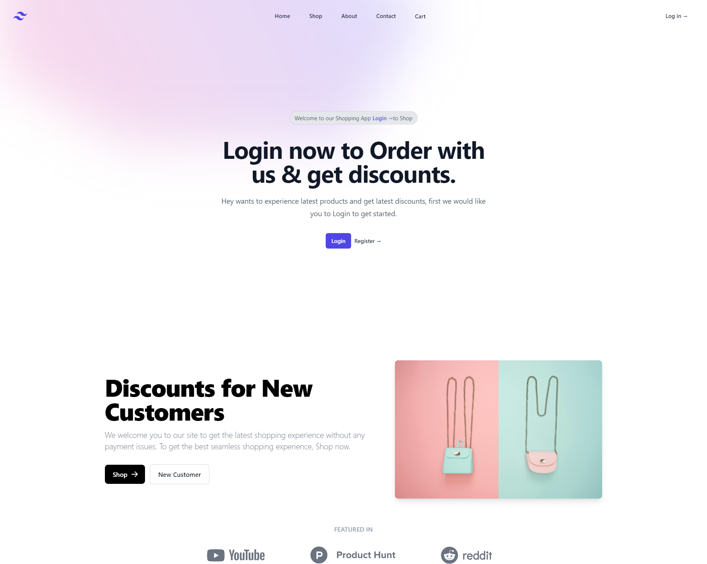
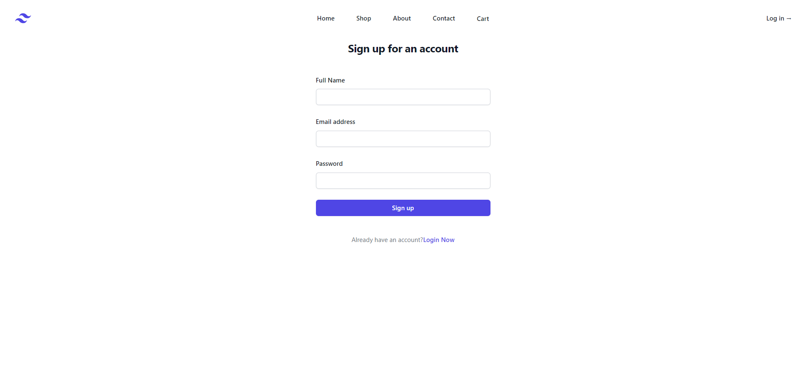
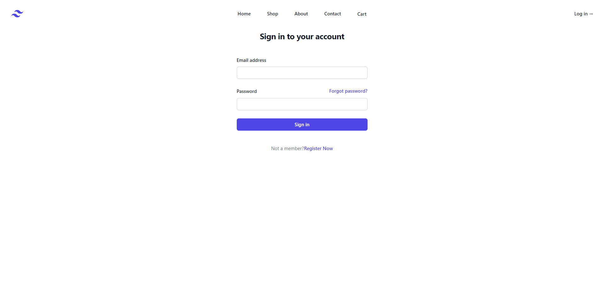
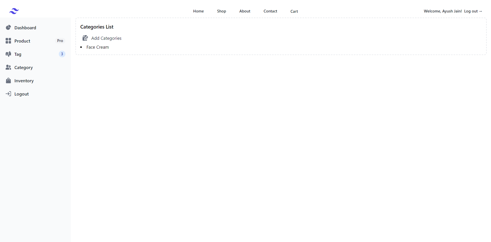
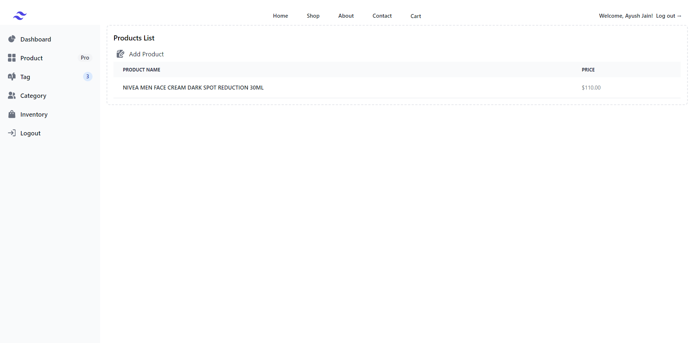
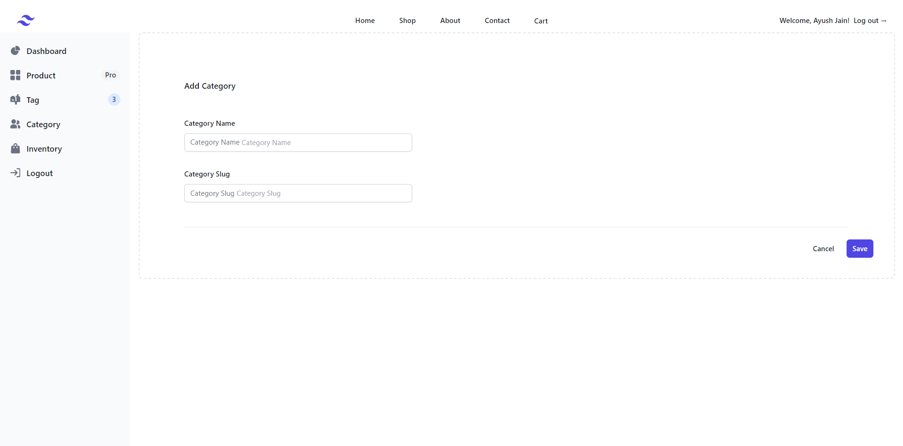
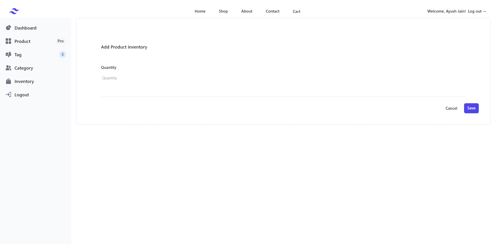

# [Docker Ecommerce](https://www.linkedin.com/in/ayush-jain-654617145/) `Dockerized`
This Project is dockerized With [Ecommerce](https://www.linkedin.com/in/ayush-jain-654617145/) ,(This project main aim was to ease ecommerce development business with main idea to dockerize the whole application and through this we will in future provide ECommerce Node JS Solution at a lower price). Currently this project runs on NodeJS. In this project currently we areNodeJS Authentication System for Login & Registration(/backend) directory for Backend , for frontend(/frontend) images are stored in backend /images directory from wich images are being loaded. 
#Node


- 👉 *Frontend ONLY Version*: [Nowhere hosted](https://www.linkedin.com/in/ayush-jain-654617145/) `v1.0.2`
- 🎁 Developed by  [Ayush](https://www.linkedin.com/in/ayush-jain-654617145/), - `Team`


<br />
There are two ways to create & start this project first start normally as usual.
<br />

## Start with `Docker`

```bash
$ cp .env.example to .env      # Prepare the environment
$ docker-compose up -d --build # Start the APP in Docker
$ sh bash                      # Set up Laravel (migrate DB and the rest of the steps)(optional)
```

At this point, the app runs on backend port `8000` and frontend port `3000`. For more information, please read the [detailed docs](./README_Docker.md)[needs to be created].

<br />

[]()

<br />

We are developing this project at continous rate with many future integration keeping  in mind.

> For any query, **Contact us** at [ayush2202ksr@gmail.com](mailto:ayush2202ksr@gmail.com).

## Table of Contents
* [Prerequisites](#prerequisites)
* [Installation](#installation)
* [Usage](#usage)
* [Versions](#versions)
* [Demo](#demo)
* [Documentation](#documentation)
* [Login](#login)
* [Register](#register)
* [Forgot Password](#forgot-password)
* [Reset Password](#reset-password)
* [User Profile](#user-profile)
* [Dashboard](#dashboard)
* [File Structure](#file-structure)
* [Browser Support](#browser-support)
* [Reporting Issues](#reporting-issues)
* [Licensing](#licensing)


## Prerequisites

If you don't already have an React and Node local environment with NodeJS and MySQL, use one of the following links:

 - Windows: https://nodejs.org/dist/v21.7.1/node-v21.7.1-x64.msi
 - Linux: https://nodejs.org/dist/v21.7.1/node-v21.7.1-linux-ppc64le.tar.xz
 - Mac: https://nodejs.org/dist/v21.7.1/node-v21.7.1.pkg

Also, you will need to start the project and run it for that  clone : https://github.com/ayush12993/Ecommerce-Docker-Node-JS-MYSQL  this repository.


## Installation
1. Unzip the downloaded archive
2. Copy and paste **Ecommerce-Docker-Node-JS-MYSQL** folder in your **projects** folder. Rename the folder to your project's name
3. In your terminal go to  backend run `nmp i` and in frontend run `npm i`
4. I have already created `.env` and updated the configurations (mainly the database configuration and email credentials, also do not forget to also change APP_URL as it is used in some of the files)
5. In your backend folder terminal run `npm start` and it will be started at port 8000
6. In your frontend folder terminal run `npm start` and it will be started at port 3000
7. Backend will be accessed at `http://localhost:8000` & Frontend will be accessible at `http://localhost:3000`.


## Usage
Register a user or login with default user **your_name@your_email.com** and password **secret_password** from your database and start testing (make sure to run the `table.sql` for the Login/Signup page to be working perfectly).

Besides the login/register there is admin page also in which user can add tags, categories , inventory & products also.


## Demo
| Register                               | Login                               | Dashboard          |
|----------------------------------------|-------------------------------------|--------------------|
| []() | []() | Under Construction |

| Forgot Password Page | Reset Password Page                                                                       | Profile Page                                                                                   |
|----------------------|-------------------------------------------------------------------------------------------|------------------------------------------------------------------------------------------------|
| Under Construction   | Under Construction | Under Construction |


## Documentation
The documentation for the ECommerce Node JS Website is currently not hosted anywhere will be hosted in future  .

### Login
If you are not logged in you can only access this page or the Sign Up page. The default url takes you to the login page where you use the default credentials **name@email.com** with the password **secret**. Logging in is possible only with already existing credentials. 

The `frontend/src/auth/Login.js` handles the logging in of an existing user.


### Register
You can register as a user by filling in the name, email and password for your account. You can do this by accessing the sign up page from the "**Sign Up**" button in the top navbar or by clicking the "**Sign Up**" button from the bottom of the log in form.. Another simple way is adding **/register** in the url.

The `frontend/src/auth/Register.js` handles the registration of a new user.


### Forgot Password
If a user forgets the account's password it is possible to reset the password. For this the user should click on the "**here**" under the login form.

Will be implemented in future


### Reset Password
The user who forgot the password gets an email on the account's email address. The user can access the reset password page by clicking the button found in the email. The link for resetting the password is available for 12 hours. The user must add the email, the password and confirm the password for his password to be updated.
Will be implemented in future

### User Profile
The profile can be accessed by a logged in user by clicking "**User Profile**" from the sidebar or adding **/user-profile** in the url. The user can add information like phone number, location, description or change the name and email.

Will be implemented in fututre

### Dashboard
You can access the dashboard either by using the "**Dashboard**" link It will also be implemented in fututre.
## File Structure
```
+---app
|   +---backend
|   |
|   +-------config
|   +----------db.js(It contains MySQL database config file.)
|   |
|   +-------model
|   +----------address.model.js (It contains address model for storing users address)
|   +----------addToCart.model.js (It contains address model for storing users cart)
|   +----------category.model.js (It contains address model for storing category)
|   +----------product.model.js (It contains address model for storing product)
|   +----------productInventory.model.js (It contains address model for storing productInventory)
|   +----------tag.model.js (It contains address model for storing tag)
|   +----------user.model.js (It contains address model for storing user)
|   +----------useraddress.model.js (It contains address model for storing user address)
|   |
|   +-------public
|   +----------products (It contains address model for storing product images)
|   |
|   +-------index.js (It contain controller and server starting files)
|   +-------verifyCustomerToken.js (It contain verification method for customer files)
|   +-------verifyToken.js (It contain verification method for admin files)
|   |
|   |
|   |
|   |
|   |
|   +---frontend
|   |
|   +-------admin
|   +----------AddCategory.js(For admin to add category page.)
|   +----------AddProduct.js(For admin to add product page.)
|   +----------AddProductInventory.js(For admin to add product inventory page.)
|   +----------AddTag.js(For admin to add tag page.)
|   +----------CategoriesList.js(For admin to see catgories list.)
|   +----------FileUpload.js(For admin to upload image this file is being called in AddProduct.js.)
|   +----------ProductInventoryList.js(For admin to see product inventory list.)
|   +----------ProductList.js(For admin to see product list.)
|   +----------TagsList.js(For admin to see product list.)
|   |
|   +-------auth
|   +----------Login.js (It contains Login page)
|   +----------Logout.js (It contains Logout page)
|   +----------Register.js (It contains Register page)
|   +----------verifyToken.js (It contains token decryption method)
|   |
|   +-------components
|   +----------navbar
|   +-----------------navbar.js (It contains navigation bar)
|   |
|   +-------customer
|   +----------AddAddress.js (It contains Address page after checkout user is redirected to add address)
|   |
|   +-------pages
|   +----------product
|   +-----------------Checkout.js (It contains checkout page)
|   +-----------------productDetail.js (It contains each product info)
|   +-----------------Shop.js (It contains products list page)
|   +----------About.js (It contain About us page)
|   +----------Contact.js (It contain contact us page)
|   +----------Home.js (It contain home page)
|   |
|   +-------App.js (It contain all the routers and navbar)
|   +----------Register.js (It contains Register page)
|   +----------verifyToken.js (It contains token decryption method)
|   +-------public
|   +----------products (It contains address model for storing product images)
|   |
|   +-------index.js (It contain controller and server starting files)
|   +-------verifyCustomerToken.js (It contain verification method for customer files)
|   +-------verifyToken.js (It contain verification method for admin files)
|   |
|   |
....

```
Admin Page--------------------------

Tag List
[]()
Category ist
[]()
Product List
[]()
Product Inventory List
[]()


Add Tag
[]()
Add Category
[]()
Add Product
[]()
Add Product Inventory
[]()


## Browser Support
At present, we officially aim to support the last two versions of the following browsers:

[]()
[]()
[]()
[]()
[]()


## Reporting Issues
We use GitHub Issues as the official bug tracker for the Ecommerce Node JS based docker shopping application. Here are some advices for our users that want to report an issue:

1. Make sure that you are using the latest version of the Ecommerce Node JS docker application. Check the CHANGELOG from your dashboard on our [repoitory](https://github.com/ayush12993/Ecommerce-Docker-Node-JS-MYSQL).
2. Providing us reproductible steps for the issue will shorten the time it takes for it to be fixed.
3. Some issues may be browser specific, so specifying the browser you encountered the issue on might help.


## Licensing
- Copyright 2024 [ayush12993](https://github.com/ayush12993)


